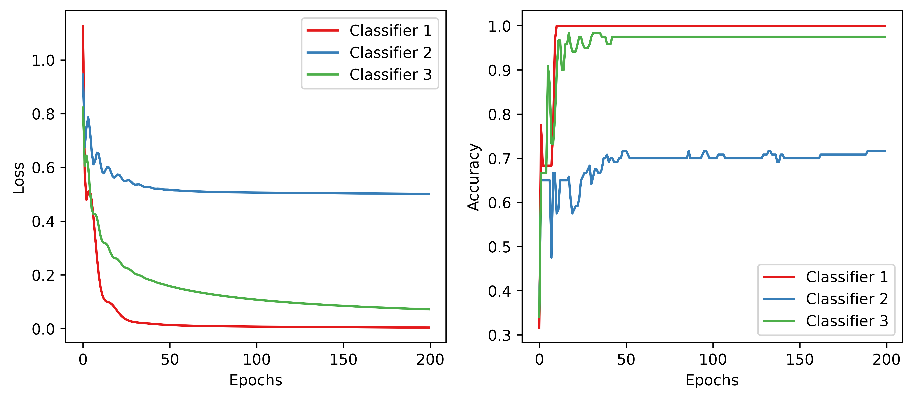

## Description
This repository presents the implementation of Linear Regression in Python 3.12 and TensorFlow v2.16 on the Iris dataset. My practice with TensorFlow library led me to create this repository. Thus, this is a useful resource for anyone using the TensorFlow library for machine learning tasks. The problem at hand is a multi-class classification task, which is addressed using the One-vs-Rest (OvR) approach. The included .ipynb file offers detailed explanations and comments for each implementation part.

## Logistic Regression

Linear Regression is for estimating continuous values, such as predicting house prices. However, Linear Regression falls short when the goal shifts to predicting the most likely class for a given data point. In such cases, <u>Logistic</u> Regression emerges as the preferred choice. Unlike Linear Regression, Logistic Regression assesses the probability of a data point belonging to a specific class, thus proving invaluable in classification tasks.

Logistic Regression is a variation of Linear Regression, useful when the dependent variable <i>y</i> is categorical. Despite the name logistic <i>regression</i>, it is a <b>probabilistic classification</b> model. Logistic regression fits a special s-shaped curve by taking the linear regression and transforming the numeric estimate into a probability with the following function:

$$
ProbabilityOfaClass = \theta(y) = \frac{e^y}{1 + e^y}
$$

which produces values between 0 (as y approaches minus infinity $-\infty$) and 1 (as y approaches plus infinity $+\infty$). This now becomes a special kind of non-linear regression.

In the equation, <i>y</i> is the regression result (the sum of the variables weighted by the coefficients), $e$ is the exponential function, and $\theta(y)$ is the logistic function, also called a logistic curve. It is a common "S" shape (sigmoid curve).

## One-vs-Rest (OvR) Approach
OvR is a heuristic method for using binary classification algorithms for multi-class classification. This involves splitting the multi-class dataset into multiple binary classification problems. A binary classifier is then trained on each binary classification problem and predictions are made using the model that is the most confident. For Iris dataset we would have:
Binary Classification 1: Setosa vs [Versicolor, Virginica]
Binary Classification 2: Versicolor vs [Setosa, Virginica]
Binary Classification 3: Virginica vs [Setosa, Versicolor]

## Requirements
The code is implemented in Python 3.12 Below are the non-standard libraries and their corresponding versions used in writing the code:
<pre>
matplotlib==3.8.3
numpy==1.26.4
scikit_learn==1.4.1.post1
tensorflow==2.16.1
</pre>

## Results

The plot below shows the effectiveness of each classifier in predicting labels and reducing the loss for their respective binary label-predicting tasks. Additionally, the ++test++ accuracy of predicting labels using the predictions of all classifiers is **0.73%**, which is the highest accuracy achieved so far. However, the scikit-learn library can achieve a perfect accuracy of 0.98%, and I am still in the process of understanding how it achieves this result.

  

